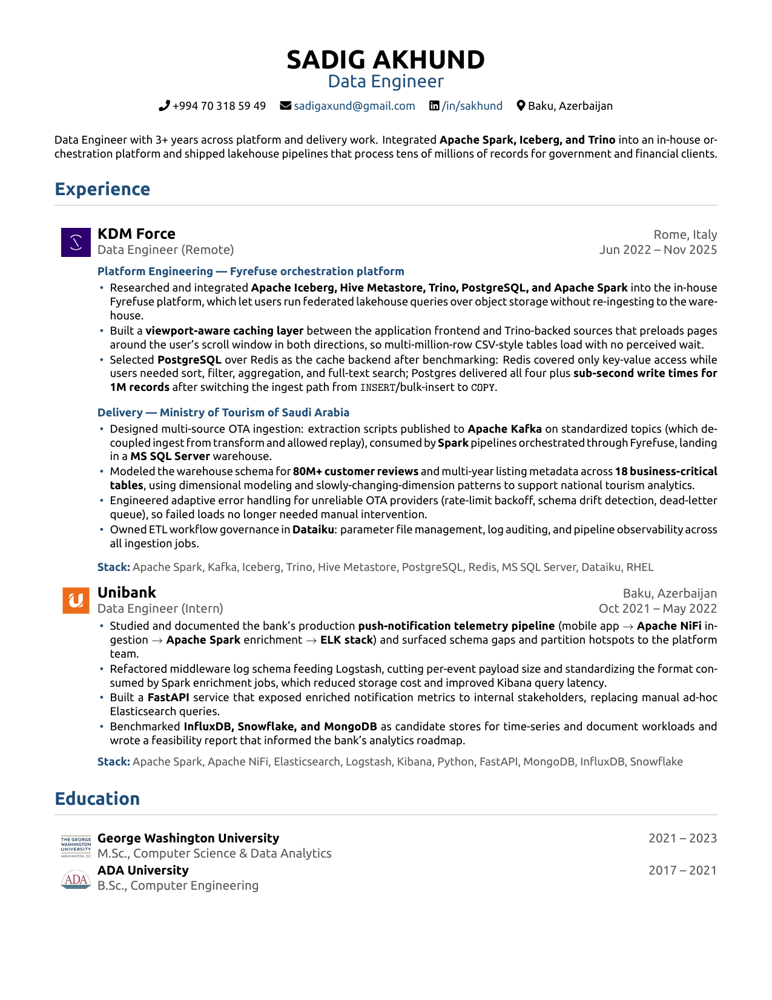

# Sadig Akhund — Resume

Data Engineer · Baku, Azerbaijan

[**Download latest PDF →**](SadigAkhund_Resume.pdf)

<!-- LAST_UPDATED -->_Last updated: 2026-07-12_<!-- /LAST_UPDATED -->



---

## Repository

| What | Where |
|------|-------|
| Source | [`SadigAkhund_Resume.tex`](SadigAkhund_Resume.tex) |
| Latest PDF | [`SadigAkhund_Resume.pdf`](SadigAkhund_Resume.pdf) |
| Version history | [`Archive/`](Archive/) |
| Build scripts | [`scripts/`](scripts/) |

## Build

```bash
./scripts/install-deps.sh   # one-time: install LaTeX packages (Fedora)
./scripts/build.sh          # compile PDF + regenerate preview.png
./scripts/version-commit.sh # archive current PDF with date suffix + commit
```

Compiler: `xelatex` via `latexmk`. Ubuntu font is vendored under [`fonts/`](fonts/), so the build is self-contained.

> On every push that changes `SadigAkhund_Resume.tex`, GitHub Actions rebuilds the PDF, regenerates the preview, archives a dated copy into [`Archive/`](Archive/), and commits the results back.

## Contact

- Email: sadigaxund@gmail.com
- LinkedIn: [/in/sakhund](https://linkedin.com/in/sakhund)
